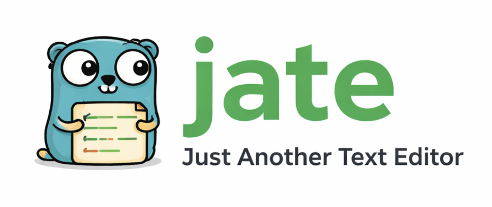
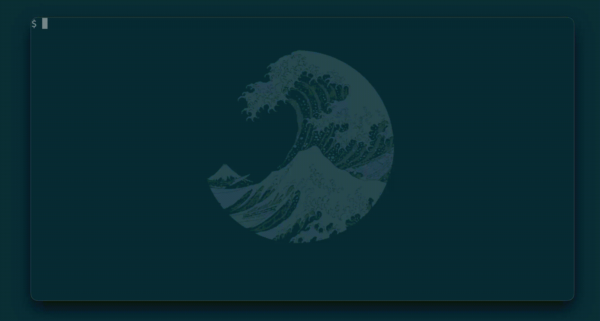

<table>
<tr>
<td>

# jate - just another text editor

I started this project to learn something about text editors, terminals and the programming language go. The
base of the editor is kilo.c, a small terminal text editor written by [antirez](https://antirez.com/news/108). To learn more about
the kilo editor I recommend Paige Ruten's [tutorial](https://viewsourcecode.org/snaptoken/kilo/).

</td>
<td width="200">



</td>
</tr>
</table>

## Demo



## Keys

| Key | Action |
| --- | ------ |
| Ctrl-s | save |
| Ctrl-f | search |
| Ctrl-c | quit |

## Run
```shell
  go run .
  go run . <file>
```

## Build
```shell
  go build
```
